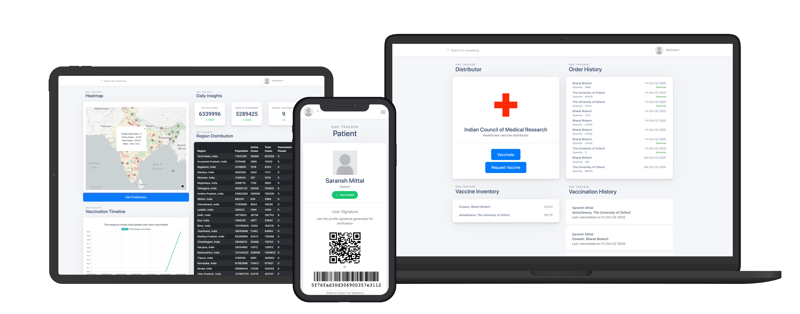
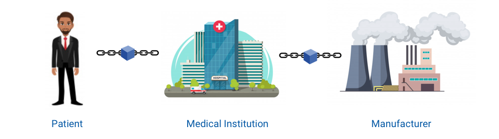

# IvyHacks 2020, Cov-VAX

<!-- TABLE OF CONTENTS -->
## Table of Contents

* [Introduction](#Introduction)
* [Product Reveal](#Product-Reveal)
* [User Story](#User-Story)
* [Conclusion](#Conclusion)

## Introduction

Hi everyone, we are Team Alpha-India, with our product Cov-VAX, making vaccinations reliable, safe, and secure. In the current COVID-19 age of widespread misinformation, various untested miracle cures being touted, and the ever-present danger of counterfeiting of drugs, it is vital for any misinformation or fears regarding the CoVID vaccines to be quelled.

What if we could develop a system that would track a vaccine throughout its entire lifecycle in the vaccine distribution system, from the Pharma manufacturer, all the way to the patient? Also making the process transparent would increase confidence in the vaccines among the population and reduce misinformation.

## Product Reveal

Introducing Cov-VAX, a blockchain powered vaccine distribution system. Using an easy-to-use web interface and IBM’s Hyperledger Fabric, we have created a ledger that tracks the progression of each vaccine through the supply chain. Let’s explain the process in a better manner with an example.

## User Story

Let’s consider Sonia, a dean of medicine at XYZ Hospital in Bangalore, India. She wants to acquire a batch of 40 vaccines to deal with the rising demand for vaccinations. So, she logs into the hospital’s account on our website, and requests for 40 vaccines from ABC Pharma in Pune, India. Raj at ABC Pharma sees her order, and approves it. Every handover point in the supply chain is authenticated using a QR code on the vaccines, which is linked directly to the Hyperledger blockchain. Now, the vaccines have arrived at Sonia’s hospital, and Ajay comes in to get his vaccination. The nurse/doctor opens up our website, and scans the QR code on the vaccine, which checks with our blockchain to see if it is valid. If it is valid, Ajay’s QR code is then scanned and the vaccination is administered. Thus, the patient is happy that the vaccine is valid, and also allows for accurate reporting of completed vaccinations.

## Conclusion

This demographic data is available publicly through an API and can be leveraged by healthcare officials and the government. A sample dashboard that we have developed shows CoVID cases and vaccinations across the different states of India. It also incorporates real-time updates from Government CoVID data to inform the herd immunity predictor, which is the minimum population that must be vaccinated in an area. Our hope is that through Cov-VAX, better transparency of the vaccinations process, and data reporting will help patients, doctors, manufacturers, and government officials make informed decisions in these trying times and bring our world of pre March 2020 back to us quicker!

## Developers

 - [Saransh Mittal](http://saransh.xyz)
 - Hemant H Kumar
